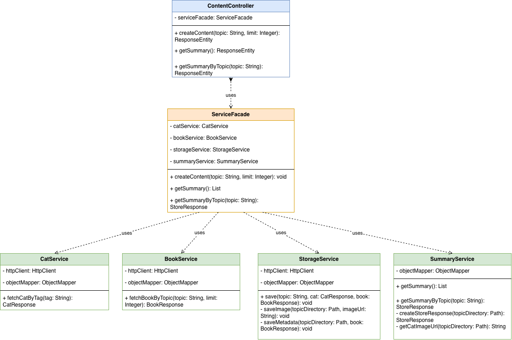

# Technical Questions

## 1. What did the existing code do?

The existing code consisted of three main classes: `CatService`, `CatResponse`, and `CatController`.

`CatResponse` defined the response returned by the endpoint. It contained two fields: `tag` and `imageUrl`.

`CatService` used the given tag to send a request to the CATAAS API. It parsed the returned JSON response, retrieved the cat ID, and used this ID to build the image URL. It then returned the tag and image URL as a `CatResponse`.

`CatController` exposed the endpoint using `@GetMapping("/cat/{tag}")`. When the endpoint was called, it delegated the request to `CatService` and returned the resulting `CatResponse` to the client.

---

## 2. What did you find wrong with it, and what did you do about it?

First, I noticed that error cases were not handled clearly. If CATAAS returned an unsuccessful response or the expected cat ID was missing, the application could return a general `500 Internal Server Error`. I added validation and exception handling so that these cases return clearer error messages and more appropriate HTTP status codes.

Secondly, the original code created an `ObjectMapper` manually using `new ObjectMapper()`. Since Spring Boot already provides and configures an `ObjectMapper`, I changed this to constructor injection.

Finally, while testing with a tag such as `ayse cat`, I noticed that spaces and special characters needed to be encoded correctly in the request URL. The original implementation constructed the URL by concatenating strings. I changed this to use `UriComponentsBuilder`, which handles URL encoding more safely. I used AI assistance while researching and implementing this change.

---

## 3. Walk us through the decisions you made that weren't specified — structure, error handling, naming, or anything you had to figure out yourself.

### Project Structure and Facade

I decided to use the Facade pattern to coordinate communication between the controllers and the different services.

Instead of having the controller directly coordinate `CatService`, `BookService`, `StorageService`, and `SummaryService`, I created a `ServiceFacade` to manage this flow.

This keeps the controller simpler and provides a single place for coordinating the application's main operations. It also makes it easier to extend the flow if another service or API is added later.

### BookService and Open Library

I created `BookService` for the Open Library integration, together with `Book` and `BookResponse` models.

Open Library can return a large number of results, so I decided not to automatically retrieve every available page. The application uses a default limit of 100 books, while allowing the client to provide a different limit when needed.

For the `Book` model, I selected only the fields that were useful for this project instead of storing the complete Open Library response. I decided the fields myself and used AI assistance to generate repetitive code such as constructors, getters, and setters.

`BookResponse` contains the topic, the Open Library request URL, and the list of returned books.

### SSL Handshake Handling

During testing, I occasionally received an `SSLHandshakeException` when making an external HTTP request. Retrying the same request once sometimes succeeded.

To prevent a temporary handshake failure from immediately failing the whole operation, I created a `sendRequest` method that retries the request once when an `SSLHandshakeException` occurs.

I intentionally limited this to one retry to avoid uncontrolled retry loops. I consider this a temporary resilience measure rather than a complete solution to the underlying SSL issue.

### StorageService

The task requires storing the CATAAS image and the Open Library metadata locally.

I also needed to preserve enough information to reconstruct the original cat image URL for the summary endpoint.

I considered storing the cat URL inside `metadata.json` or creating another JSON file specifically for the cat information. After considering these options, including discussing them with AI, I decided to store the CATAAS image ID in the image file name instead.

The original CATAAS image URL can then be reconstructed using the stored ID and the CATAAS base URL.

If the same topic is requested again, the previous image is removed before the new image is stored. This ensures that each topic has only its latest stored cat image.

### Summary

For the summary endpoint, I wanted to return information that would be useful to an API consumer rather than only indicating whether files exist.

The summary therefore contains information such as:

- total number of stored books
- book titles
- publication year range
- cat image URL
- Open Library URL

AI initially suggested a simpler summary containing boolean values such as whether an image or metadata file existed. I decided to return more descriptive information instead.

### Exception Handling

I added custom exceptions such as `BookNotFoundException`, `CatNotFoundException`, `TopicNotFoundException`, and `InvalidTagException`.

These exceptions are handled centrally by a `GlobalExceptionHandler`.

This allows the API to return clearer error messages and appropriate HTTP status codes instead of exposing unexpected errors as a general `500 Internal Server Error`.

### Path Traversal Protection

I used AI to review my code for possible security issues, and it helped me identify a path traversal risk. Because the topic provided by the user is also used when creating local storage paths, values such as ../../something could potentially access paths outside the intended storage directory.

After understanding the issue, I added path validation and created a shared path utility so that both storage and summary operations use the same validation logic.
### Swagger UI

I also added Swagger UI because I have previously used it during internships for backend development and API testing.

I added the required dependency, created an OpenAPI configuration, and added `@Operation` descriptions to the endpoints.

This provides interactive API documentation and makes the endpoints easier to understand and test.

---

## 4. Which parts did you use AI tools for? What did you prompt, what did it give you, and did you change anything?

I mainly used AI as a development support and code review tool. I used chat-based AI because I preferred to understand and apply the changes step by step rather than generating the entire project at once.Terminal-based AI is certainly more useful, but I didn't choose it because I wanted to be able to track the process more effectively.

I asked questions about topics such as:

- how I could improve parts of the existing code
- whether there were possible security issues
- how I could reduce duplicated code
- how URL encoding should be handled
- how to structure error handling
-how to solve errors I encountered during development

For example, after deciding which fields my models should contain, I used AI assistance to generate repetitive code such as constructors, getters, and setters.Or, I've designed examples in JSON format and asked AI to directly code response models. I've also asked where I needed to improve the code I wrote and what I could write to make it better.on. I reviewed the suggestions, tried to understand the reasoning behind them, and changed or rejected them when I thought another solution was more suitable for the project.
I also asked the AI ​​to rewrite the readme and solutions in a way that conforms to the md format.
---

## 5. What did the AI get wrong or miss, if anything?

Some of the initial AI suggestions were simpler than the architecture I wanted for the project.

For example, the initial solution did not suggest using a Facade. I decided to introduce `ServiceFacade` myself to coordinate the different services and keep the controllers focused on handling HTTP requests.

AI also initially suggested keeping storage and summary logic together. I separated them into `StorageService` and `SummaryService` because I considered writing data and generating summaries to be different responsibilities.

Also, the code for getSummary() and getSummarytopic() was almost identical; that's how it was presented to me, but I thought it would be better to use a private method in both, so I implemented it that way in my code.

Another example was the summary response. An initial suggestion used simple values such as `hasBook: true` and `hasImage: true`. I did not find this information very useful for an API consumer, so I designed the summary to include the number of books, book titles, publication year range, and image URL instead.

AI was useful for reviewing the implementation, explaining unfamiliar concepts, and identifying possible problems, but I evaluated the suggestions and made the final architecture and implementation decisions.

---

## 6. The storage is local for now. How would you approach making it production-ready?

The current local file-system storage is suitable for this task, but I would not rely on it as the primary storage mechanism in a production environment.

For production, I would use a persistent database for structured application data. I would model topics and their associated book metadata so that the relationships can be queried and managed reliably.

For the images, I would use object storage rather than storing image binary data directly in the database. The database would store the corresponding object key, URL, or other storage reference.

I would also improve the external API communication layer by adding explicit connection and request timeouts, controlled retries with backoff for transient failures, and better handling of unavailable external services.

The current single retry for `SSLHandshakeException` is intentionally simple. In production, I would first investigate and fix the underlying SSL issue and then use a more general resilience strategy only for failures that are actually safe to retry.

---

## 7. What's the weakest part of your solution? What would you do differently with more time?

The part I would most like to improve is the handling of `SSLHandshakeException`.

During development and testing, I occasionally encountered an `SSLHandshakeException` when sending requests to the external APIs. In my current solution, when this exception occurs, I retry the request once. This worked during my tests, but I see it as a temporary solution because it does not solve the root cause of the problem.

With more time, I would first investigate the actual cause of the `SSLHandshakeException` and try to solve it without depending on a retry. I would also improve the external API communication by adding proper timeout handling and a more controlled retry mechanism.

I would also improve testing. I would add more unit and integration tests, especially for external API failures, timeout cases, unexpected API responses, invalid inputs, path validation, and local storage operations.

Another area I would improve is pagination. Open Library can return a large number of results, so my current implementation limits the number of books returned. With more time, I would implement proper pagination so that users could retrieve the results page by page.

Finally, I would reconsider how the cat image information is stored. Currently, I store the CATAAS image ID in the image file name and use it later to rebuild the image URL. This works for the current project, but for a larger system, I would prefer to store the image information in a separate metadata structure.